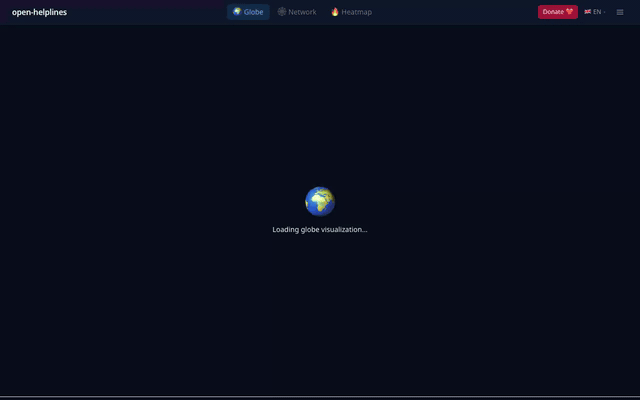

<div align="center">

# open-helplines

**LLMによる危機相談番号の幻覚を防ぐ。MCP 1行で、常に検証済みデータを。**

*世界のメンタルヘルス相談窓口をオープンデータで。CC0。APIキー不要。ベンダーロックインなし。*

[](https://github.com/Kouki-odaka/open-helplines/actions/workflows/pr.yml)
[](https://www.npmjs.com/package/@open-helplines/mcp)
[](https://glama.ai/mcp/servers/Kouki-odaka/open-helplines)
[](https://www.npmjs.com/package/@open-helplines/core)
[](https://pypi.org/project/open-helplines/)
[](data/countries/)
[](LICENSE-DATA)
[](LICENSE)
[](https://securityscorecards.dev/viewer/?uri=github.com/Kouki-odaka/open-helplines)
[](https://github.com/Kouki-odaka/open-helplines/graphs/contributors)
[](https://star-history.com/#Kouki-odaka/open-helplines&Date)

<!-- DEMO: Task #16 の GIF 完成後にここへ埋め込む -->


[🌐 可視化サイト](https://kouki-odaka.github.io/open-helplines/ja/) ·
[📖 ドキュメント](docs/) ·
[💬 ディスカッション](https://github.com/Kouki-odaka/open-helplines/discussions) ·
[❤️ サポート](https://kouki-odaka.github.io/open-helplines/ja/donate/)

</div>

---

## クイックスタート — MCP（Claude Desktop / 任意の MCPホスト）

`claude_desktop_config.json` に追記して Claude Desktop を再起動するだけ。APIキーも設定も不要：

```json
{
  "mcpServers": {
    "open-helplines": {
      "command": "npx",
      "args": ["@open-helplines/mcp"]
    }
  }
}
```

あとは Claude に話しかけるだけです：

> *「日本で24時間対応している自殺防止の相談窓口を教えて」*  
> *「ブラジルで英語対応しているメンタルヘルス窓口はある？」*  
> *「ユーザーが危機的な状態に見える。オーストラリアで一番近い相談窓口は？」*

Claude はレジストリ内のデータから電話番号と URL を**そのまま**返します。架空の情報は生成しません。

使用できる MCP ツール: `find_helplines`、`get_helpline_by_id`、`list_countries`。  
フルセットアップ手順: [examples/mcp-claude-desktop/README.md](examples/mcp-claude-desktop/README.md)

---

## なぜ必要なのか

### 課題：LLMは危機相談番号を幻覚する

メンタルヘルスチャットボット、AI コンパニオン、LLM エージェントは、困っているユーザーと日常的に接します。相談窓口を案内しようとすると、2つの問題にぶつかります：

1. **商業的ロックイン** — ThroughLine などの既存ディレクトリは有料・利用規約が厳しく、データ自体はパブリックドメインであるにもかかわらず API キーが必要です。
2. **幻覚リスク** — 検証済みデータソースなしでは、LLM はもっともらしい電話番号を生成してしまいます。誤った番号は単なる UX の問題ではなく、**人命に関わる安全上の問題**です。

### 解決策：open-helplines

open-helplines は、**検証済み・構造化された CC0 データ**と本番対応の MCP サーバーでこのギャップを埋めます：

| 機能 | 概要 |
|:---|:---|
| **CC0 データ** | パブリックドメイン。AI 学習・商用利用を含むあらゆる用途で帰属表示不要。 |
| **JSON Schema** | Draft 2020-12。TypeScript 型と Python Pydantic モデルをスキーマから自動生成。 |
| **MCP サーバー** | `npx @open-helplines/mcp` — Safe Answer ガードレール内蔵。 |
| **Emergency First Resolver** | 危機関連キーワードで即座に CVD 対応バナーを表示。ワンタップで電話・テキスト・チャット。 |
| **No-Log Crisis Finder** | プライバシー保護検索 — クエリログなし、ユーザー追跡なし。 |
| **24 か国対応・拡大中** | AU, BD, BR, CA, CN, DE, EG, FR, GB, ID, IN, JP, KR, MX, NG, NZ, PH, PK, RU, TR, UA, US, VN, ZA |

---

## 日本のメンタルヘルス相談窓口について

日本では、誰もが一度は心の危機を経験しうる社会環境の中で、「いのちの電話」「よりそいホットライン」「よりそいホットライン（DV・性暴力・ハラスメント）」「こころの健康相談統一ダイヤル」「子どもの人権110番」など、複数の相談窓口が設置されています。深夜・休日に対応できる窓口は限られており、AI アシスタントが正確な連絡先を即座に提示できることは、危機的状況にある人への支援において重要な意味を持ちます。

open-helplines に収録されている日本のデータは定期的に検証されており、電話番号・URL はすべて `verified_at` フィールドで管理されています。窓口情報の追加や番号の修正は [プルリクエスト](https://github.com/Kouki-odaka/open-helplines/blob/main/CONTRIBUTING.md) でご参加いただけます。

---

## Claude.ai（日本語）での活用イメージ

Claude Desktop に open-helplines MCP を設定すると、Claude.ai の日本語インターフェースから直接、世界の相談窓口を検索できます。例えば：

- 「海外在住の日本人向けにメンタルヘルスの相談先を探している」
- 「英語が不安なユーザーのために、日本語対応の国際相談窓口はある？」
- 「自殺防止の窓口を日本と韓国で比較したい」

応答に含まれる電話番号と URL はレジストリから直接取得されるため、LLM が番号を推測・生成することはありません。Anthropic MCP 仕様に準拠しており、Claude.ai の最新バージョンであればそのまま動作します。

---

## 機能詳細

### 🛡️ Safe Answer ガードレール

すべての MCP ツールは 5 つのガードレールを自動的に適用します。追加設定は不要です：

| ガードレール | 動作 |
|:---|:---|
| **鮮度チェック** | `verified_at` が 6 か月以上前 → レスポンスに `STALE_DATA` 警告を付与 |
| **誤誘導防止** | `record.country` ≠ リクエスト国 → `DIFFERENT_COUNTRY_CONTEXT` 警告 |
| **フォールバックチェーン** | データなし → 近隣国 → IASP/Befrienders 国際ディレクトリ |
| **強制引用** | 全レコードに `source`・`verified_at`・`last_checked_url_status` を含む |
| **幻覚拒否** | 未知の国/ID → `DATA_NOT_FOUND` sentinel（絶対に推測しない） |

詳細: [`docs/features/safe-answer-mcp-guardrails.md`](docs/features/safe-answer-mcp-guardrails.md)

### 🚨 Emergency First Resolver

[可視化サイト](https://kouki-odaka.github.io/open-helplines/ja/)で危機関連ワードを検索すると、最寄りの 24 時間対応窓口が CVD 対応バナーで即座に表示されます。電話・テキスト・チャットのワンタップリンク付き。

詳細: [`docs/features/emergency-first-resolver.md`](docs/features/emergency-first-resolver.md)

### 🔍 No-Log Crisis Finder

プライバシー保護設計の危機相談検索。クエリのログ記録なし、ユーザーフィンガープリントなし、検索内容のアナリティクス収集なし。

詳細: [`docs/features/no-log-crisis-finder.md`](docs/features/no-log-crisis-finder.md)

### 🌍 可視化サイト

レジストリをビジュアルで探索：
- **グローブビュー** — 世界地図上でのカバレッジ表示（インタラクティブ 3D）
- **ヒートマップ** — カバレッジ密度のコロプレスマップ
- **ネットワークグラフ** — 組織間の関係図

→ [kouki-odaka.github.io/open-helplines/ja](https://kouki-odaka.github.io/open-helplines/ja/)

---

## インテグレーション例

### TypeScript / Node.js

```ts
import { loadCountry } from "@open-helplines/core";

const records = await loadCountry("JP");
const crisis = records.filter(r => r.category === "suicide_prevention");

for (const r of crisis) {
  console.log(r.name, r.contacts[0].number);
}
```

### Python

```python
from open_helplines import Registry

registry = Registry.from_github()
records = registry.find(country="JP", category="suicide_prevention")

for r in records:
    print(r.name, r.contacts[0].number)
```

### JSON（依存ライブラリ不要）

```sh
# 全対応国一覧
curl -s https://raw.githubusercontent.com/Kouki-odaka/open-helplines/main/data/index.json | \
  jq '.countries[] | {country, record_count}'

# 日本の全データ（自殺防止カテゴリ絞り込み）
curl -s https://raw.githubusercontent.com/Kouki-odaka/open-helplines/main/data/countries/jp/helplines.json | \
  jq '.records[] | select(.category == "suicide_prevention") | {name, contacts: [.contacts[].number]}'
```

---

## JSON Schema

```
https://raw.githubusercontent.com/Kouki-odaka/open-helplines/main/schemas/helpline.schema.json
```

JSON Schema Draft 2020-12 — 型定義・バリデーションの唯一の情報源。（[ADR-001](docs/adr/ADR-001-json-schema-draft-2020-12.md)）

---

## コントリビュート

**データの修正・追加は常に歓迎です。ディスカッションは不要で、直接 PR を開いてください。**

あなたが知っている国の正確な電話番号を追加・修正するだけでも、大きな貢献になります。

スキーマの変更には [GitHub ディスカッション](https://github.com/Kouki-odaka/open-helplines/discussions)での事前合意が必要です。

詳細: [CONTRIBUTING.md](CONTRIBUTING.md)（データフォーマット・品質要件・コミット規約）

---

## コミュニティ

💬 **[GitHub ディスカッション](https://github.com/Kouki-odaka/open-helplines/discussions)** — 機能リクエスト、カバレッジに関する質問、スキーマ提案、一般的な議論の場です。

特に、各国のデータ精度を検証できる専門家・NPO スタッフの参加を歓迎しています。

| ドキュメント | 内容 |
|:---|:---|
| [CODE_OF_CONDUCT.md](CODE_OF_CONDUCT.md) | コミュニティ行動規範（Contributor Covenant 2.1） |
| [SECURITY.md](SECURITY.md) | 脆弱性報告ポリシー |
| [GOVERNANCE.md](GOVERNANCE.md) | プロジェクトガバナンスと意思決定フロー |
| [プレスキット](docs/press-kit/README.md) | ロゴ・説明文・主要事実（メディア向け） |

---

## スポンサー

open-helplines は無料・オープン・CC0 であり、今後もそうあり続けます。このプロジェクトが役に立った場合は、データの検証と開発の継続のためにサポートをご検討ください：

- ❤️ [プロジェクトサイトから寄付](https://kouki-odaka.github.io/open-helplines/ja/donate/)
- 🌟 GitHub Sponsors — 準備中（[FUNDING.yml](.github/FUNDING.yml) 参照）
- 🏛️ Open Collective — 準備中

---

## ライセンス

open-helplines は**デュアルライセンス**を採用しています：

| コンポーネント | ライセンス | 理由 |
|:---|:---|:---|
| **データ** (`data/**`, `dist/by-*/*.json`) | [CC0 1.0](LICENSE-DATA) | 最大限の利用可能性 — 帰属表示不要で危機支援ツール・AI 学習・商用利用が可能 |
| **コード**（TypeScript、Python、スクリプト、ワークフロー） | [Apache-2.0](LICENSE) | 特許保護と帰属表示フレンドリー |

### 日本向け補足

- **CC0（クリエイティブ・コモンズ ゼロ）**: データは著作権・隣接権をすべて放棄しています。商用・非商用を問わず、帰属表示なしで自由に使用・改変・配布できます。
- **Apache-2.0**: コードは Apache License 2.0 に従います。利用・改変・配布の際は著作権表示と NOTICE ファイルの保持が必要です。特許ライセンス条項により、コントリビューターとユーザーを保護します。

詳細: [NOTICE](NOTICE)（デュアルライセンス宣言）、[docs/LICENSING.md](docs/LICENSING.md)（商用利用・AI 学習・二次著作物ポリシー）

---

## アーキテクチャ上の決定事項

| ADR | 決定内容 |
|:---|:---|
| [ADR-001](docs/adr/ADR-001-json-schema-draft-2020-12.md) | JSON Schema Draft 2020-12 を唯一の情報源として採用 |
| [ADR-002](docs/adr/ADR-002-cc0-data-apache-code.md) | CC0 データ + Apache-2.0 コードのデュアルライセンス |
| [ADR-003](docs/adr/ADR-003-per-country-files.md) | 国別ファイル構造 |
| [ADR-004](docs/adr/ADR-004-mcp-server-design.md) | MCP サーバー — stdio トランスポート、3 ツール |

---

## 免責事項

open-helplines は**開発者向けツール**です。連絡先情報のディレクトリであり、危機対応サービスではありません。

- リスクの評価・カウンセリング・緊急対応には対応していません。
- 電話番号は定期的に検証されますが、リアルタイム確認ではありません。エンドユーザーには必ず `verified_at` の日付を表示してください。
- **誰かが今すぐ危険な状態にある場合は、まず地域の緊急サービス（110、119）に連絡するよう案内してください。**

詳細: [docs/safety/SAFETY.md](docs/safety/SAFETY.md)（完全な安全ポリシーと責任ある LLM 統合ガイドライン）

---

<div align="center">

[](https://star-history.com/#Kouki-odaka/open-helplines&Date)

*open-helplines が誤った相談番号の提供を防ぎ、一人でも多くの人に正確な情報が届くなら、⭐ をつける価値があります。*

</div>
