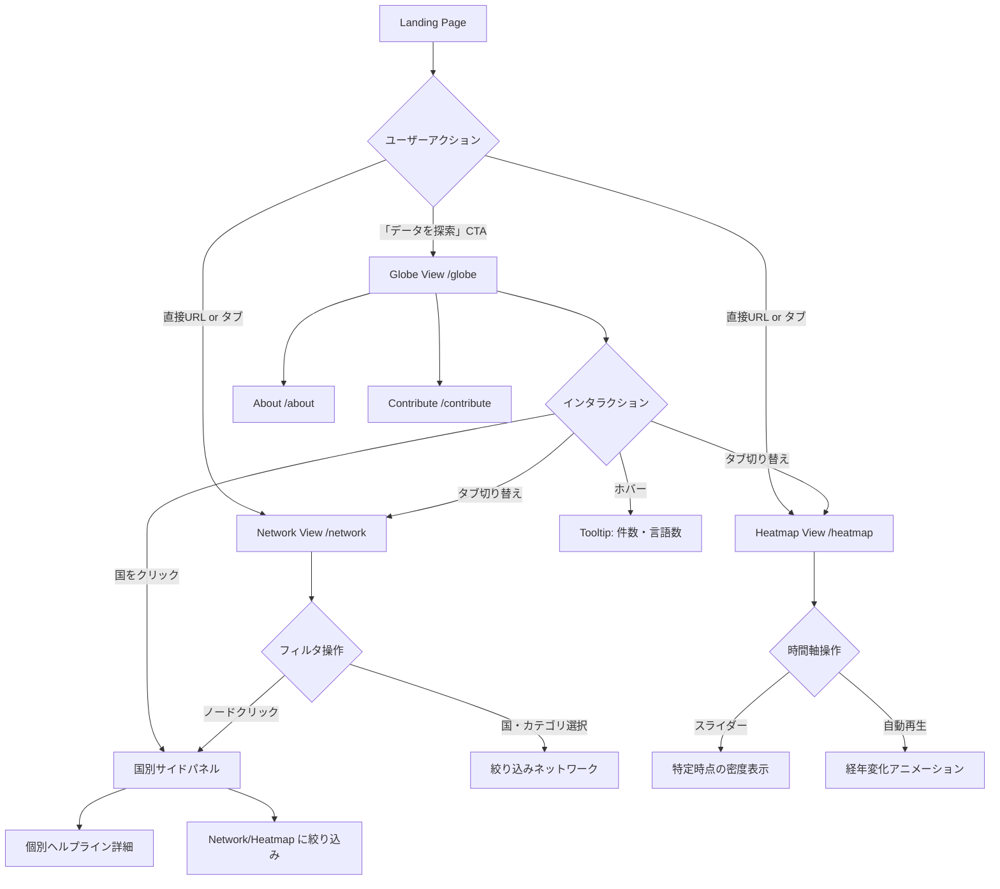

# open-helplines 視覚化サイト UX 設計書

> **Status:** Draft v1.0 — 2026-06-02  
> **Author:** UI/UX Designer Agent (uiux-viz)  
> **Target URL:** `https://kouki-odaka.github.io/open-helplines/`  
> **Tech stack:** Next.js 14 (static export) → GitHub Pages, `examples/web/` 配下

---

## 1. Information Architecture（サイト全体構成）

### 1.1 ページ構成

```
/                     ← Landing（プロジェクト概要 + CTAボタン）
/globe                ← メインビュー A: 3D Globe（デフォルトビュー）
/network              ← サブビュー B: Multi-axis Network
/heatmap              ← サブビュー C: Geographic × Time Heatmap
/about                ← プロジェクト背景・ライセンス (CC0/Apache-2.0)
/contribute           ← データ追加・貢献方法
```

### 1.2 ナビゲーション設計

```
┌──────────────────────────────────────────────────────────────┐
│  [Logo: open-helplines]        Globe | Network | Heatmap | ≡ │
└──────────────────────────────────────────────────────────────┘
```

- **トップナビバー:** 固定（sticky）、高さ 48px、ダークモード対応
- **左側:** テキストロゴ `open-helplines` + CC0バッジ SVG
- **中央:** ビュー切り替えタブ（Globe / Network / Heatmap）
- **右端:** ハンバーガーメニュー（About / Contribute / GitHub リンク）
- **モバイル（< 768px）:** タブはアイコン + ラベル省略形、ハンバーガー展開でフルナビ

### 1.3 ユーザーフロー図



---

## 2. メインビュー A: 3D Globe ワイヤーフレーム

### 2.1 データ表現方式の選定

**選定: Column（光柱） + Point Cloud（ズームアウト時フォールバック）**

| 方式 | 根拠 |
|:--|:--|
| **Column（光柱）** ✓ | 件数の絶対値を高さで直感的に表現。国別比較が容易。mental health 文脈で「灯台」的な視覚的メタファー |
| Arc | 経路・接続関係がない単国データには不適切 |
| Point Cloud | ズームアウト時に多国を密に表示するフォールバックとして補助的に使用 |

**エンコーディング:**
- **柱の高さ:** `helpline_count`（対数スケール: `log(n+1)`、外れ値圧縮）
- **柱の色:** カラーマッピング方式（後述 §2.2）
- **柱の太さ:** 固定（国面積に依存しない、公平な比較）
- **ズームイン時（< 1国サイズ）:** Point Cloud → Column に自動切替

### 2.2 カラーマッピング

デフォルトは **件数マップ（sequential）**、ヘッダーのラジオボタンで切り替え可能。

| モード | 色の意味 | パレット |
|:--|:--|:--|
| **件数** (default) | helpline 数（高いほど明るい） | `viz-blue-sequential` (§2.3) |
| **カテゴリ密度** | 最多カテゴリで色分け | `viz-category-12` |
| **言語対応数** | 多言語対応の豊富さ | `viz-green-sequential` |

### 2.3 CVD-safe カラーパレット（Globe専用）

**設計根拠:** Mental health ユーザーが利用する可能性が高い。色覚異常（第1色盲・第2色盲、約8%/男性）に対応する Okabe-Ito ベースパレットを採用。

```
viz-blue-sequential （件数グラデーション）:
  最小: #f0f9ff  →  中間: #38bdf8  →  最大: #0ea5e9  →  特大: #0369a1

viz-green-sequential （言語数グラデーション）:
  最小: #f0fdf4  →  中間: #4ade80  →  最大: #16a34a

viz-category-12 （12カテゴリ識別）:
  suicide_prevention  : #E69F00
  mental_health       : #56B4E9
  domestic_violence   : #009E73
  sexual_violence     : #F0E442
  substance_abuse     : #0072B2
  youth               : #D55E00
  lgbtq               : #CC79A7
  veterans            : #999999
  elder               : #44AA99
  grief               : #332288
  general_crisis      : #88CCEE
  other               : #DDDDDD
```

> 参考: Okabe & Ito (2008)「Color Universal Design」+ Bang Wong (2011)

**ダークモード対応:**
- 背景: `#0a0e1a`（深宇宙ネイビー）
- グローブ海洋: `#1a2744`
- グローブ陸地: `#1e3a5f`
- 光柱は `opacity: 0.85` で発光効果（`mix-blend-mode: screen`）

### 2.4 インタラクション設計

#### 2.4.1 全体操作

| 操作 | Desktop | Mobile |
|:--|:--|:--|
| 回転 | マウスドラッグ / トラックパッドスワイプ | タッチドラッグ（1本指） |
| ズーム | スクロールホイール / ピンチ | ピンチイン/アウト |
| パン | 右クリック + ドラッグ | 2本指ドラッグ |
| 国選択 | 左クリック | タップ |
| リセット | ダブルクリック背景 | ダブルタップ背景 |
| 自動回転 | 操作がない場合 5秒後に再開 | 同左 |

#### 2.4.2 ホバー Tooltip（Desktop）

```
┌──────────────────────┐
│ 🇯🇵 Japan            │
│ ──────────────────── │
│ Helplines: 8         │
│ Languages: 12        │
│ Categories: 4        │
└──────────────────────┘
```
- 国旗はSVG（Unicode 絵文字ではなくflag-icon-css or twemoji SVG）
- Tooltipは画面端を超えない（`getBoundingClientRect` で反転制御）

#### 2.4.3 国別サイドパネル（クリック後）

```
┌─────────────────────────────────────┐
│  [×]  Japan（日本）          🇯🇵     │
│ ─────────────────────────────────── │
│  8 helplines  · 12 languages        │
│                                     │
│  [suicide_prevention] Inochi no D.. │
│    📞 +81-120-783-556   24/7        │
│  [general_crisis] Yorisoi Hotline   │
│    📞 +81-120-279-338   24/7        │
│  ...                                │
│                                     │
│  [Network で絞り込み →]             │
│  [Heatmap で絞り込み →]             │
└─────────────────────────────────────┘
```
- 右サイドバー（デスクトップ: 320px幅）
- モバイル: 画面下部からスライドアップ（bottom sheet、高さ 60vh）
- アイコンはLucide SVG（📞 は `Phone` アイコンに置換）

### 2.5 モバイル対応

```
┌────────────────────┐
│ open-helplines [≡] │
│ [Globe|Net.|Heat.] │  ← アイコン + 短縮ラベル
│────────────────────│
│                    │
│  [3D Globe        ]│  ← タッチ対応、フルスクリーン
│                    │
│────────────────────│
│ Country count: 22  │  ← 統計フッターバー
└────────────────────┘
```

- グローブは `width: 100vw; height: calc(100vh - 96px)` で全画面表示
- 低性能端末向けに `prefers-reduced-motion: reduce` 対応（自動回転無効化）

---

## 3. サブビュー B: Network View ワイヤーフレーム

### 3.1 ビジュアライゼーション方式の選定

**選定: Node-Link（Force-directed graph）**

| 方式 | 評価 |
|:--|:--|
| **Node-Link** ✓ | 多対多の関係を自由に探索できる。カテゴリ↔言語↔連絡手段の複雑な交差をユーザーが直感的に辿れる。D3 force simulation で実装容易 |
| Sankey | フローの「量」を可視化するのに強いが、帰属先が双方向にある helpline データには不適切（1本線が多義的になる） |
| Chord | 国vs国などの2軸比較には強いが、今回は4軸のため視覚的に過密になる |

### 3.2 ノード設計

**4種類のノードタイプ:**

| ノードタイプ | 形状 | 色 |
|:--|:--|:--|
| **Country** | 円（大、r=16px） | `#56B4E9`（viz-category-12 mental_health色） |
| **Category** | 六角形（中、r=12px） | `viz-category-12` の対応色 |
| **Language** | 菱形（小、r=10px） | `#E69F00` |
| **Contact Method** | 正方形（小、r=10px） | `#009E73` |

**エッジ:**
- 太さ: helpline との共起数に比例（min 1px, max 4px）
- 色: ソースノードの色を透明度 0.4 で使用

### 3.3 フィルタ設計

```
┌─────────────────────────────────────────────────────────┐
│  [Country ▼]  [Category ▼]  [Language ▼]  [リセット]    │
└─────────────────────────────────────────────────────────┘
```

- ドロップダウン複数選択（react-select）
- フィルタ変更時: 非該当ノードは `opacity: 0.1` にフェード（アニメーション 300ms）
- 「0件」状態には空状態メッセージ: "No helplines match the current filters."

### 3.4 インタラクション

| 操作 | 動作 |
|:--|:--|
| ノードホバー | 直接接続エッジ以外を `opacity: 0.1` に暗転（ego network ハイライト） |
| ノードクリック（Country） | Globe の国別サイドパネルと同内容を表示 |
| ノードクリック（Category/Language/Method） | そのノードに接続するhelpline一覧をサイドパネルに表示 |
| 背景クリック | ハイライト解除 |
| ズーム | スクロール / ピンチ（`d3.zoom` ） |

### 3.5 モバイル対応

- モバイルでは Force 強度を弱め、ノードサイズを 1.3倍に拡大（タップしやすくする）
- 最大表示ノード数: 50（超過時は「トップ50を表示中」バナー）

---

## 4. サブビュー C: Heatmap View ワイヤーフレーム

### 4.1 地理 × 時間の表現設計

**レイヤー構成:**

```
┌──────────────────────────────────────────────────────────┐
│  [Country ▼]  [Category ▼]         [▶ Play]  [Reset]    │
│──────────────────────────────────────────────────────────│
│                                                          │
│  [世界地図 Choropleth Map                               ] │
│  （国を色密度でフィル）                                   │
│                                                          │
│──────────────────────────────────────────────────────────│
│  [← 2020]━━━━━━━━━━●━━━━━━━━━━[2026 →]   2026-06       │
│  (年月スライダー)                                         │
│──────────────────────────────────────────────────────────│
│  [時系列折れ線グラフ: 月次追加件数]                       │
└──────────────────────────────────────────────────────────┘
```

### 4.2 地図表現

- **ベースマップ:** Natural Earth SVG（軽量、CC0、`react-simple-maps` or `d3-geo`）
- **エンコーディング:** Choropleth（国ポリゴンをhelpline密度で塗り分け）
  - 密度 = `helpline_count / population_million`（相対密度）or `helpline_count`（絶対数）でトグル可能
- **カラースケール:** `viz-blue-sequential`（CVD-safe、`§2.3`と統一）
- **ホバー:** ポップアップで国名・件数・最終追加日

### 4.3 経年変化の表現

**データ属性:** `verified_at` フィールド（`YYYY-MM-DD`）を使用してタイムライン構築。

**スライダー設計:**
- 粒度: 月次（`YYYY-MM`）
- レンジ: データ最古 `verified_at` ～ 現在
- 操作: ドラッグ or キーボード左右矢印（アクセシビリティ対応）
- `aria-label="Time period selector"`, `role="slider"`, `aria-valuenow`, `aria-valuemin`, `aria-valuemax` 必須

**自動再生:**
- 再生ボタン（Lucide `Play` / `Pause` SVG）
- 速度: 1ヶ月 = 200ms（デフォルト）、遅/速 の2段切り替え
- `prefers-reduced-motion: reduce` 時は自動再生無効、スライダーのみ

### 4.4 時系列折れ線グラフ（マップ下部）

- 月次追加レコード数の推移
- 現在スライダー位置に対応する縦線を表示（トラッキングライン）
- X軸: 月次、Y軸: 追加件数、凡例: カテゴリ別（`viz-category-12`）

---

## 5. デザインシステム

### 5.1 カラーパレット全体（CVD-safe）

詳細トークン定義は `visualization-tokens.md` を参照。

**基本方針:**
- Okabe-Ito 8色 + Tol 拡張 4色 = 計12カテゴリ色
- ライトモード / ダークモード 両対応
- コントラスト比: テキスト上では AA 基準（4.5:1）以上を保証
- 色だけで情報を伝えない（形状・テクスチャ・ラベル を色に必ず併用）

### 5.2 タイポグラフィ（多言語対応）

```
フォントスタック:
  sans-serif: "Inter var", "Noto Sans", "Noto Sans JP", 
              "Noto Sans Arabic", "Noto Sans Simplified Chinese",
              system-ui, sans-serif

  mono: "JetBrains Mono", "Noto Sans Mono", monospace
```

**サイズスケール:**

| トークン | サイズ | 用途 |
|:--|:--|:--|
| `text-xs` | 12px / 0.75rem | データラベル、フッター |
| `text-sm` | 14px / 0.875rem | Tooltip、フィルタUI |
| `text-base` | 16px / 1rem | 本文、サイドパネル |
| `text-lg` | 18px / 1.125rem | セクション見出し |
| `text-2xl` | 24px / 1.5rem | ページ見出し |
| `text-4xl` | 36px / 2.25rem | Landing ヒーロータイトル |

**行間:** `leading-relaxed`（1.625）で多言語テキストの可読性確保  
**文字間:** `tracking-normal`（英文）/ `tracking-wide`（日本語見出し）  
**最大行長:** 70ch（本文 prose）

### 5.3 スペーシング・レイアウト

```
spacing スケール (Tailwind 準拠):
  4px → 8px → 12px → 16px → 24px → 32px → 48px → 64px → 96px
```

**ブレークポイント:**

| 名称 | 幅 | 対象 |
|:--|:--|:--|
| `sm` | 640px | 大スマートフォン |
| `md` | 768px | タブレット |
| `lg` | 1024px | ラップトップ |
| `xl` | 1280px | デスクトップ |

### 5.4 アクセシビリティ要件

- **フォーカス:** `outline: 2px solid var(--color-focus-ring)`（`outline: none` 禁止）
- **クリック領域:** 最小 44×44px
- **スクリーンリーダー:**
  - グローブの国別データは非表示テーブルとして DOM 提供（`aria-hidden="true"` on canvas）
  - `<table aria-label="Helplines by country" class="sr-only">` をページ内に配置
- **キーボード操作:** 全インタラクティブ要素がタブ順序で到達可能
- **動き:** `prefers-reduced-motion` で Globe 自動回転・Heatmap 再生を無効化

### 5.5 ロゴ案

**案: テキストロゴ + CC0 バッジ（SVG）**

```
  ◎ open-helplines                   CC0
  └─ アイコン: 地球を示す円（Lucide `Globe` SVGベース）
               + 内側に十字（ヘルスケア象徴、mental health文脈）
```

- SVG テキストロゴ: `open-helplines` in Inter Bold
- カラー: ライト時 `#0ea5e9`、ダーク時 `#38bdf8`
- CC0 マーク: Public Domain / CC0 公式 SVG をそのまま利用
- 最小サイズ: 24px 高（モバイルナビ内）

---

## 6. ページ別ワイヤーフレーム概略

### 6.1 Landing Page `/`

```
┌──────────────────────────────────────────────────────┐
│  [Navbar]                                            │
├──────────────────────────────────────────────────────┤
│                                                      │
│  ◎ open-helplines                                    │
│  ─────────────────────────────────                   │
│  Open data registry of mental health                 │
│  helplines worldwide.                                │
│  Free · CC0 · No API key required.                   │
│                                                      │
│  [Explore the Globe →]   [View on GitHub]            │
│                                                      │
│  ● 22 countries  ● 80+ helplines  ● 15 languages     │
│                                                      │
├──────────────────────────────────────────────────────┤
│  How to use: MCP / TypeScript / Python / CDN         │
├──────────────────────────────────────────────────────┤
│  [Footer: CC0 Data · Apache-2.0 Code · GitHub]       │
└──────────────────────────────────────────────────────┘
```

### 6.2 Globe View `/globe`

```
┌──────────────────────────────────────────────────────┐
│  [Navbar: Globe tab active]                          │
├─────────────────────────┬────────────────────────────┤
│                         │  [サイドパネル: 国選択時]   │
│  [3D Globe]             │  Country: Japan            │
│  （タッチ/ドラッグで    │  8 helplines               │
│   自由回転、光柱表示）   │  [一覧...]                 │
│                         │                            │
├─────────────────────────┴────────────────────────────┤
│  Color: [Count ●] [Category] [Languages]             │
│  Data: 22 countries · 83 helplines                   │
└──────────────────────────────────────────────────────┘
```

### 6.3 About Page `/about`

- プロジェクト背景（Why this exists）
- ライセンス説明（CC0 データ / Apache-2.0 コード）
- 安全性に関する注記（ADR-004 準拠: 番号は verbatim 使用）

### 6.4 Contribute Page `/contribute`

- データ追加手順（`CONTRIBUTING.md` 参照）
- JSON Schema フォームプレビュー（将来的な実装候補）
- GitHub Issues へのリンク

---

## 7. ファイル構成（`examples/web/` 配下）

```
examples/web/
├── next.config.js         # output: 'export', basePath: '/open-helplines'
├── package.json
├── tailwind.config.ts     # visualization-tokens を Tailwind に注入
├── public/
│   ├── favicon.svg
│   └── logo.svg
├── src/
│   ├── app/               # App Router
│   │   ├── layout.tsx     # Navbar + global styles
│   │   ├── page.tsx       # Landing
│   │   ├── globe/
│   │   │   └── page.tsx   # Globe View
│   │   ├── network/
│   │   │   └── page.tsx   # Network View
│   │   ├── heatmap/
│   │   │   └── page.tsx   # Heatmap View
│   │   ├── about/
│   │   │   └── page.tsx
│   │   └── contribute/
│   │       └── page.tsx
│   ├── components/
│   │   ├── globe/
│   │   │   ├── GlobeCanvas.tsx    # WebGL Globe
│   │   │   ├── CountryPanel.tsx   # サイドパネル
│   │   │   └── ColorToggle.tsx    # マッピング切り替え
│   │   ├── network/
│   │   │   ├── NetworkGraph.tsx   # D3 force graph
│   │   │   └── NetworkFilters.tsx
│   │   ├── heatmap/
│   │   │   ├── ChoroplethMap.tsx  # react-simple-maps
│   │   │   ├── TimeSlider.tsx
│   │   │   └── TimelineLine.tsx   # recharts / d3
│   │   └── ui/
│   │       ├── Navbar.tsx
│   │       ├── Tooltip.tsx
│   │       ├── SidePanel.tsx
│   │       └── Badge.tsx
│   ├── lib/
│   │   ├── data.ts                # データ読み込み
│   │   └── colors.ts              # CVD-safe パレット定数
│   └── styles/
│       └── globals.css            # Tailwind + CSS variables
└── .github/
    └── workflows/
        └── deploy.yml             # GitHub Pages static export
```

---

## 8. 技術選定（実装チームへの推奨）

| 用途 | 推奨ライブラリ | 代替 |
|:--|:--|:--|
| 3D Globe | `globe.gl` (Three.js ベース, tree-shakeable) | `react-globe.gl` |
| Network Graph | `d3-force` + `d3-selection` | `react-force-graph` |
| Choropleth Map | `react-simple-maps` + `d3-geo` | `deck.gl` |
| データ可視化共通 | `d3` (v7) | – |
| アニメーション | `framer-motion` (reduced-motion 対応) | `react-spring` |
| UIコンポーネント | Tailwind CSS + Radix UI（a11y 保証済） | shadcn/ui |
| アイコン | `lucide-react`（SVGベース、tree-shakeable） | Heroicons |
| フォント | `@fontsource/inter` + `next/font` (Google Noto) | – |

---

## 9. アクセシビリティ チェックリスト（実装前確認用）

- [ ] グローブ・マップの代替テキストテーブル（`sr-only` クラス）
- [ ] カラーモード切替ボタンに `aria-pressed`
- [ ] スライダーに `role="slider"` + `aria-valuenow`
- [ ] フォーカスリングが全操作可能要素に表示
- [ ] 最小タッチターゲット 44×44px
- [ ] `prefers-reduced-motion` による自動アニメーション無効化
- [ ] コントラスト比 4.5:1 以上（Lighthouse CI で自動確認）
- [ ] キーボード単独でグローブ回転・国選択が可能

---

*設計書 EOF — 実装チーム (`se-viz`) への共有後、フィードバックに応じて更新予定。*
